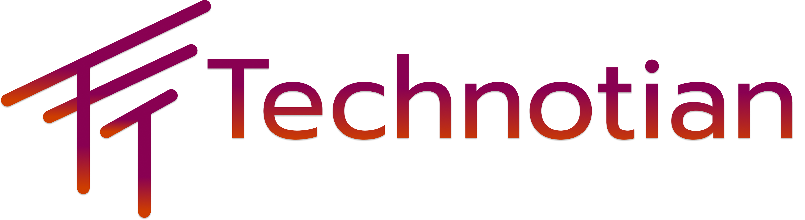

# Technotian - Desarrollo Web y Software Personalizado



## 🚀 Descripción del Proyecto

Sitio web corporativo de **Technotian**, empresa especializada en desarrollo web, software personalizado y automatización de procesos empresariales en Colombia.

## 🎯 Servicios

- **Desarrollo Web**: Sitios web personalizados, aplicaciones web y plataformas e-commerce
- **Automatización**: Automatización de workflows empresariales y optimización de recursos
- **Marketing Digital**: Estrategias digitales y gestión de redes sociales para empresas
- **Consultoría**: Asesoría en transformación digital y auditorías tecnológicas

## 🛠️ Tecnologías Utilizadas

### Frontend
- HTML5 semántico
- CSS3 con animaciones avanzadas
- JavaScript vanilla
- Responsive Design
- Google Fonts (Prompt, Aboreto, Akronim)
- Material Icons

### SEO y Performance
- Meta tags optimizados
- Schema.org structured data
- Open Graph y Twitter Cards
- Sitemap XML
- Robots.txt optimizado
- Lazy loading de imágenes
- Core Web Vitals optimizado

## 📁 Estructura del Proyecto

```
Technotian/
├── index.html                 # Página principal
├── styles.css                # Estilos CSS principales
├── script.js                 # JavaScript para funcionalidad
├── robots.txt                # Directrices para motores de búsqueda
├── sitemap.xml              # Mapa del sitio
├── seo-meta-optimized.js    # Meta tags SEO dinámicos
├── seo-schema-advanced.js   # Datos estructurados Schema.org
├── seo-performance.js       # Optimizaciones de rendimiento
├── img/                     # Recursos de imágenes
│   ├── logotipe-2.png      # Logo principal
│   ├── icono.png           # Favicon
│   └── [otras imágenes]    # Imágenes de servicios y tecnologías
└── README.md               # Documentación del proyecto
```

## 🎨 Características del Diseño

- **Responsive**: Adaptable a dispositivos móviles, tablet y desktop
- **Animaciones**: Efectos visuales con gradientes dinámicos
- **UX Optimizado**: Navegación intuitiva y carga rápida
- **Accesibilidad**: Atributos ARIA y navegación por teclado
- **SEO Friendly**: Optimizado para motores de búsqueda

## 🌐 Secciones del Sitio

1. **Hero Section**: Presentación principal con call-to-action
2. **Servicios**: Tarjetas interactivas con servicios principales
3. **Experiencia**: Slider con proyectos por sector
4. **Tecnologías**: Stack tecnológico utilizado
5. **Footer**: Información de contacto y redes sociales

## 📧 Contacto

- **Email**: contacto@technotian.com
- **WhatsApp**: +57 311 7914720
- **Teléfono**: +57 301 2635685
- **Instagram**: [@technotian](https://www.instagram.com/technotian/)

## 🔧 Instalación y Uso

1. Clona este repositorio:
   ```bash
   git clone [URL_DEL_REPOSITORIO]
   ```

2. Abre el proyecto:
   ```bash
   cd Technotian
   ```

3. Abre `index.html` en tu navegador o usa un servidor local:
   ```bash
   # Con Python
   python -m http.server 8000
   
   # Con Node.js
   npx serve .
   ```

## 🚀 Deployment

El sitio está optimizado para deployment en:
- GitHub Pages
- Netlify
- Vercel
- Cualquier servidor web estático

## 📝 Licencia

© 2025 Technotian - Todos los derechos reservados.

## 🤝 Contribución

Para contribuir al proyecto:

1. Fork el repositorio
2. Crea una nueva rama (`git checkout -b feature/nueva-caracteristica`)
3. Commit tus cambios (`git commit -m 'Agregar nueva característica'`)
4. Push a la rama (`git push origin feature/nueva-caracteristica`)
5. Abre un Pull Request

---

**Desarrollado con ❤️ por Technotian**